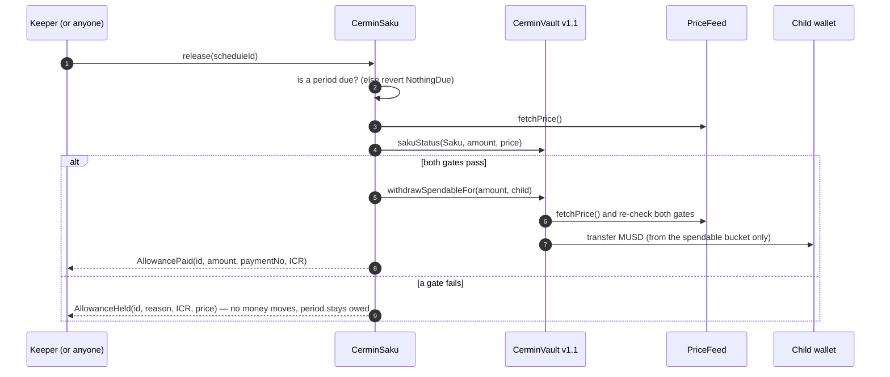
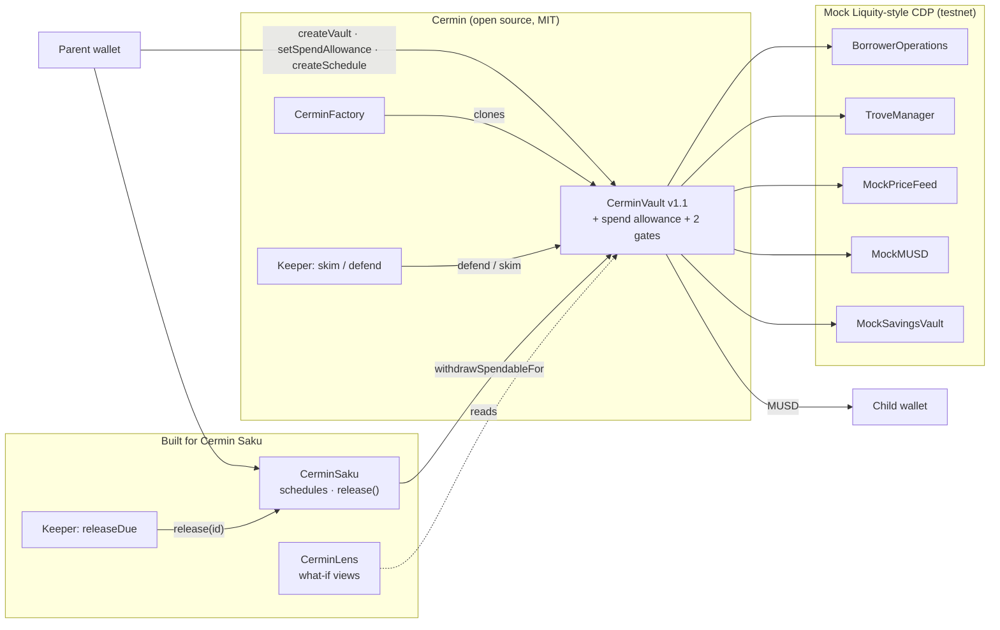

<div align="center">

# Cermin Saku

**An allowance from your BNB that knows when to hold back.**
*Uang saku dari BNB-mu, yang tahu kapan harus menahan diri.*

Scheduled allowances paid from a BNB vault on BNB Chain. The vault contract itself refuses a payment
when the position is not safe, and pays it once it is. No BNB is sold to pay an allowance.
Parents sign in with Google or email (a wallet is created for them) or bring their own wallet.

Built on **Cermin**, an open-source vault engine (MIT) · Indonesia Web3 Hackathon 2026 · BSC testnet

<!-- PROOF-LINKS:START -->
Live app: [cermin-saku.vercel.app](https://cermin-saku.vercel.app) · Demo video: [YouTube](https://youtu.be/FEZUq4Cbgrs) · Demo vault, no wallet: [/demo](https://cermin-saku.vercel.app/demo) · [Contracts on BscScan](#contracts)
<!-- PROOF-LINKS:END -->

</div>

---

## The problem, in one family

A parent in Medan holds BNB and wants to send a monthly allowance to a child at university in Jogja.
Selling BNB every month gives up the upside. Borrowing against it works (that is what
[Cermin](https://github.com/yeheskieltame/Cermin) automates) but an allowance that keeps flowing while
BNB falls can drain exactly the money the position needs to avoid liquidation.

**Cermin Saku** turns the borrowed balance (Cermin's "Shadow") into scheduled envelopes for someone
else, with one rule enforced by the contract, not by the app: *survival money comes first*.

## What is new here, in one line

Cermin already keeps a BNB-backed loan alive (borrow, skim, defend). **Cermin Saku makes recurring, delegated
spending obey that protection:** a payment that would eat the buffer defending the collateral is refused by the
vault itself, recorded on chain with its reason, and paid later when it is safe.

| Built during the hackathon (5–7 Oct 2026) | From Cermin (open source, MIT) |
|---|---|
| `CerminSaku` (schedules, permissionless `release`, holds), the two safety gates and spend allowance in `CerminVault` v1.1, `CerminLens`, the keeper's allowance payer, 45 new tests, CI, the Bahasa Indonesia + Rupiah product (landing, `/saku`, `/terima`, `/demo`, Google sign-in), our own BSC testnet deployment | the vault engine (`CerminVault`, `CerminFactory`), the skim/defend keeper, the mock CDP, the web app's base design and watercolour illustrations |

## What this prototype proves, and what it does not

| Proven here | Not proven yet |
|---|---|
| The allowance policy is enforced **inside the vault**, not by the app: `release()` checks, and `withdrawSpendableFor` re-checks | Mainnet economics: the mock CDP charges **no interest**; a real lending backend (Venus or Lista) has a borrow rate |
| A real sequence on BSC testnet: paid → price drop → **held** (`AllowanceHeld`) → keeper **defends** → price recovers → owed envelopes paid | Oracle security: the demo price feed is owner-set so a crash can be shown; production needs a real oracle with staleness checks |
| Anyone can call `release()`; a missing keeper delays payments but cannot make an unsafe one | Real liquidations (the mock does not liquidate) and stablecoin risk (MUSD is test money) |
| Lens previews equal real execution (fuzz-tested) | Demand: no user interviews yet. No Rupiah off-ramp. One keeper process. Not audited |

Details: [`docs/THREAT-MODEL.md`](docs/THREAT-MODEL.md).

## Why not just sell a little BNB every month?

For most people, selling is simpler, and that is fine. Cermin Saku is for **long-term BNB holders** who want to keep
their exposure and still meet a monthly commitment. It replaces repeated sales with a loan, which brings interest and
liquidation risk. What Cermin Saku adds is that the allowance can never quietly spend the money that protects the BNB.

An illustrative example, not a forecast. Rp 500.000 a month for 12 months is Rp 6 juta. The Balanced profile
borrows twice that (Rp 12 juta, half spendable, half kept as the defense reserve) against about Rp 24 juta of BNB.

| | Sell BNB monthly | Borrow with Cermin Saku |
|---|---|---|
| Cost over a year | upside missed on the BNB sold (about Rp 3 juta of exposure on average) | interest on Rp 12 juta: about Rp 600 ribu at an assumed 5% a year |
| BNB rises 20% | miss about Rp 600 ribu | roughly break-even |
| BNB rises more | selling costs more | borrowing wins |
| BNB flat or falls | selling is cheaper | interest, and allowances pause if the fall is deep |

Rule of thumb: borrowing beats selling only if BNB rises faster than about four times the borrow rate. When an
allowance is held, the envelope stays owed; the parent sees it on the dashboard and can add BNB to make the position
safe again sooner. For essentials such as rent, a family should not depend on a single volatile asset; we see
Cermin Saku as the allowance on top of that.

## Regulatory position

This is a testnet prototype of programmable crypto-asset allocation, **not a payment or remittance service**. In
Indonesia crypto assets are not legal tender (payments are in Rupiah) and crypto-asset trading is supervised by OJK.
The recipient receives a stablecoin, not Rupiah; a production version would deliver Rupiah only through a licensed
partner and would not convert or transmit Rupiah itself.

## Known issue in the demo video

In the opening (0:09–0:17) the Rupiah figure under "0,07 BNB" is the **price of 1 BNB**, not the value of 0.07 BNB
(about Rp 1 juta). The label was added in the video source after the upload; all on-chain figures later in the video
are exact.

## Proof

| What | Evidence | How to check |
|---|---|---|
| Contracts tested | **78 forge tests passing**: 33 original Cermin + 28 Saku unit/fuzz + 2 crash-reserve stress tests + 7 Lens + 8 in the invariant suite (7 invariants + 1 positive control; 64 runs × 64 calls each) | `cd contracts && forge test` |
| Payment never made while unsafe | invariant `invariant_NoUnsafePayment` + fuzz `testFuzz_NeverPaysBelowFloor` | [`test/saku/`](contracts/test/saku) |
| Paying never eats the defense | fuzz `testFuzz_PaidAllowanceLeavesEnoughToDefendAfterStress`: after any payment the gates allow and a further stress fall, `defend()` gets ICR back to 140% | [`SakuStress.t.sol`](contracts/test/saku/SakuStress.t.sol) |
| Saku never moves more than granted | invariants `invariant_PaidNeverExceedsGranted`, `invariant_AllowanceAccounting` | same |
| BNB collateral never decreases | `invariant_CollateralNeverDecreases` | same |
| Lens = real execution | fuzz `testFuzz_PreviewDefendEqualsDefend`, `testFuzz_PreviewSkimEqualsSkim`, `testFuzz_PausePriceIsExactBoundary` | [`CerminLens.t.sol`](contracts/test/saku/CerminLens.t.sol) |
| Keeper logic tested | **18 node:test passing** (12 original + 6 Saku) | `cd agent && npm test` |
| **Full flow on BSC testnet** | keeper paid #1 and #2 → price to $560 → `AllowanceHeld` (IcrBelowFloor, ICR 143.40%, no MUSD moved) → price to $520 → keeper `Defended` (133% → 140%) → price to $800 → owed #3 and #4 paid; collateral stayed 0.07 BNB | [`docs/TESTNET-DEPLOY.md`](docs/TESTNET-DEPLOY.md#demo-run-keeper-live) (every tx linked) |
| Full flow rehearsed on a local chain | open → pay ×2 → price drop → `AllowanceHeld(IcrBelowFloor)` → keeper `defend()` → recovery → paid again | [`docs/LOCAL-REHEARSAL.md`](docs/LOCAL-REHEARSAL.md) |
| BSC testnet deployment from Dex's own wallet | CerminSaku [`0x8603B62b82166D68A9f76d2753bD8a15066Cb6Df`](https://testnet.bscscan.com/address/0x8603B62b82166D68A9f76d2753bD8a15066Cb6Df) and 8 more, source on Sourcify | [Contracts](#contracts) |
| CI | GitHub Actions: forge build + test, keeper typecheck + test, web typecheck + lint + build | [`.github/workflows/ci.yml`](.github/workflows/ci.yml) |

## Judge path (5 minutes, no wallet needed)

1. Open the **demo vault** (`/demo` on the live app): a real demo vault on BSC testnet, its scheduled envelopes, and the passbook of every payment and hold, read from event logs.
2. Find an envelope stamped **DITAHAN** (held). Click its transaction: the `AllowanceHeld` event carries the reason (`IcrBelowFloor` or `ReserveTooThin`), the ICR and the price at that moment. No MUSD moved.
3. Drag the **"If BNB goes to Rp X"** slider. Every number is returned by `CerminLens` via `eth_call`, the same math the vault executes.
4. Read [`CerminVault.sol` → `_sakuStatus`](contracts/src/CerminVault.sol) (the two gates) and [`CerminSaku.sol` → `release`](contracts/src/CerminSaku.sol) (pay or hold).
5. Run `forge test` and look at [`SakuInvariant.t.sol`](contracts/test/saku/SakuInvariant.t.sol).

## How a payment is decided



### The two gates (in `CerminVault._sakuStatus`)

| Gate | Rule | Default (Balanced preset) |
|---|---|---|
| 1. Health floor | `ICR ≥ defendICR + floorBuffer` | keeper defends at 140%, so allowances stop below **150%** |
| 2. Crash reserve | `spendable − amount + savings ≥ repay that defend() would need to restore defendICR after a stress% drop` | after another **30%** fall, enough is left for `defend()` to bring ICR back to **140%** |

The owner can tune the policy within hard bounds (`setSakuPolicy`: buffer 5–50 points, crash reserve 10–70%; default 10 points and 30%) but cannot turn it off.

Below the 120% emergency line `defend()` aims higher (160%) and spends everything available. Gate 2 budgets for the 140% defense line, so after such a fall the position returns above 140% but may stop short of 160%; [`SakuStress.t.sol`](contracts/test/saku/SakuStress.t.sol) fuzzes this end to end.
The owner's allowance (`setSpendAllowance`) caps what Saku can move; only the owner can raise or revoke it. Payments come only out of
the spendable bucket; savings stay as the defense reserve and BNB collateral is never touched. The owner's own
`withdrawSpendable` keeps Cermin's original behaviour: Saku constrains money that leaves on *someone else's* schedule.

## Provenance

> **Provenance.** Cermin Saku is built on **Cermin**, an open-source project (MIT) by Yeheskiel Yunus Tame ([original repo](https://github.com/yeheskieltame/Cermin)): its vault engine (CerminVault + CerminFactory + the skim/defend keeper), the mock Liquity-style CDP, and the web app's base design and watercolour illustrations come from there. It was first written for Mezo Hackathon 2 (May 2026) and ported to BNB Chain by its author in late September 2026. **Built by Dex Bennett on 5–7 Oct 2026, within the hackathon submission period:** Cermin Saku (scheduled allowances paid only while the BNB position is safe), the spend allowance and the two gates in CerminVault v1.1, CerminLens (what-if price view), the keeper's allowance payer, the Bahasa Indonesia + Rupiah product on that base (rewritten landing, recoloured palette and illustrations, allowance, recipient and no-wallet demo pages, Google sign-in), our own BSC testnet deployment, tests and CI. Every line we added is in commits dated 5–7 Oct; see [`CONTRIBUTIONS.md`](CONTRIBUTIONS.md).

The first commit of this repository ([`e767fde`](https://github.com/Stylenecy/cermin-saku/commit/e767fde)) is the original published code, unchanged.
The original author's notes from the port are kept in [`docs/upstream-*.md`](docs).

## Architecture



## Contracts

<!-- CONTRACTS:START -->
**BSC testnet (chain 97)**, deployed from `0xE2D734318ffCF581b0de67FF188964CE99343BF4` at block 135154187. Source verified on [Sourcify](https://repo.sourcify.dev/97/0x8603B62b82166D68A9f76d2753bD8a15066Cb6Df). Every transaction: [`docs/TESTNET-DEPLOY.md`](docs/TESTNET-DEPLOY.md).

| Contract | Address | Role |
|---|---|---|
| CerminSaku | [`0x8603B62b82166D68A9f76d2753bD8a15066Cb6Df`](https://testnet.bscscan.com/address/0x8603B62b82166D68A9f76d2753bD8a15066Cb6Df) | new · schedules, `release`, holds |
| CerminLens | [`0x3287Be66C493d24B492c300A179B33f1a7A0B6bc`](https://testnet.bscscan.com/address/0x3287Be66C493d24B492c300A179B33f1a7A0B6bc) | new · what-if price views |
| CerminFactory | [`0x1dD819Fafc6B649dCfE682a6d165d7d8CA4C4013`](https://testnet.bscscan.com/address/0x1dD819Fafc6B649dCfE682a6d165d7d8CA4C4013) | Cermin · clones vaults |
| CerminVaultImpl | [`0x23a865ed98d471398C2b161c3C4A2fCBC129257c`](https://testnet.bscscan.com/address/0x23a865ed98d471398C2b161c3C4A2fCBC129257c) | Cermin + Saku gates (v1.1 implementation) |
| PriceFeed | [`0xab5D57Fc63C9D7D271312ffbbB8a658A883A1389`](https://testnet.bscscan.com/address/0xab5D57Fc63C9D7D271312ffbbB8a658A883A1389) | simulated BNB/USD (MockPriceFeed, seeded from Chainlink) |
| MUSD | [`0xAc319a7FffEEd3D5e1Ae7a776151168Bd0dCfe59`](https://testnet.bscscan.com/address/0xAc319a7FffEEd3D5e1Ae7a776151168Bd0dCfe59) | mock stablecoin |
| BorrowerOperations | [`0xd5F721410C2E2A373bdFA8AD6f43a78E3C6fC462`](https://testnet.bscscan.com/address/0xd5F721410C2E2A373bdFA8AD6f43a78E3C6fC462) | mock CDP |
| TroveManager | [`0x083D1955830Fe4D1039a2DcedbEfA52a1Df8fB81`](https://testnet.bscscan.com/address/0x083D1955830Fe4D1039a2DcedbEfA52a1Df8fB81) | mock CDP |
| SavingsVault | [`0x0A668Cbd794a7c7Bb17dfcC6CeD60cc092BF53C4`](https://testnet.bscscan.com/address/0x0A668Cbd794a7c7Bb17dfcC6CeD60cc092BF53C4) | mock savings (sMUSD) |
| Demo vault | [`0xfe1742bcfe1836d080f690526cd739bbae192a03`](https://testnet.bscscan.com/address/0xfe1742bcfe1836d080f690526cd739bbae192a03) | the vault shown on `/demo` |
<!-- CONTRACTS:END -->

| Contract | Source | Role |
|---|---|---|
| `CerminSaku` | [src/CerminSaku.sol](contracts/src/CerminSaku.sol) | **new** · schedules, permissionless `release`, holds |
| `CerminLens` | [src/CerminLens.sol](contracts/src/CerminLens.sol) | **new** · price lines, previews of defend / skim / Saku |
| `CerminVault` v1.1 | [src/CerminVault.sol](contracts/src/CerminVault.sol) | Cermin's vault + spend allowance + the two gates (`git diff e767fde -- contracts/src/CerminVault.sol`) |
| `CerminFactory` | [src/CerminFactory.sol](contracts/src/CerminFactory.sol) | Cermin's, unchanged |
| Mock CDP | [test/mocks](contracts/test/mocks) | Cermin's mocks; admin functions made owner-only for a public testnet |

Demo parameters: the BNB price feed is a **simulated** `MockPriceFeed` owned by our deployer, seeded from Chainlink
BNB/USD on BSC testnet at deploy time, so drops can be shown on demand. Min debt / gas compensation are deploy-time
settings (Mezo uses 2,000 / 200 MUSD; the testnet demo uses 20 / 2 so a faucet-sized vault works at a real BNB price).

## Run it

**Contracts**
```bash
cd contracts
git clone --depth 1 --branch v5.6.1 https://github.com/OpenZeppelin/openzeppelin-contracts.git lib/openzeppelin-contracts
git clone --depth 1 --branch v1.16.2 https://github.com/foundry-rs/forge-std.git lib/forge-std
forge test
```

**Full local rehearsal (Anvil):** see [`docs/LOCAL-REHEARSAL.md`](docs/LOCAL-REHEARSAL.md): deploy, open a vault, schedule an
allowance, run the keeper, move the simulated price and watch payments get held and resumed.

**Web**
```bash
cd frontend && npm ci
npm run dev   # testnet addresses come from frontend/.env.production, written by scripts/post-deploy.mjs
```
Sign-in uses [Privy](https://privy.io) (Google, email or a wallet; an embedded wallet is created on login) when
`NEXT_PUBLIC_PRIVY_APP_ID` is set, and falls back to RainbowKit's wallet connect when it is empty.

**Deploy (BSC testnet, one command)**
```bash
bash scripts/deploy-testnet.sh   # keys from ./wallets.env (gitignored): deploy, Sourcify, demo vault, wire web + keeper + README
bash scripts/rehearse-fork.sh    # same script against a local anvil fork of BSC testnet, no tBNB spent
```

**Keeper**
```bash
cd agent && npm ci && npm test
# env: PRIVATE_KEY, CERMIN_FACTORY_ADDRESS, PRICE_FEED_ADDRESS, SAKU_ADDRESS (see agent/.env.example)
npm run dev
```

## Limits we own up to

- **Mock CDP.** BNB Chain has no Liquity-style CDP; the vault runs on the original mock stack. MUSD is play money, and the mock does not execute liquidations.
- **Simulated price.** The demo feed is owner-settable so a crash can be shown. The 110% "liquidation line" is the rule a real CDP would enforce.
- **One keeper.** Our keeper is a single process. `release()` is permissionless and the vault re-checks every payment, so a missing keeper delays payments; it cannot make an unsafe one.
- **Rupiah is display only.** An indicative USD/IDR rate (ExchangeRate-API, with a dated fallback). No bank off-ramp; that is roadmap.
- **Not audited.** Hackathon code on testnet.

## Roadmap

Real CDP backend on BNB Chain (Venus / Lista adapter) · IDR off-ramp partner · recipient-side spending limits ·
multiple keepers.

## License

MIT, see [LICENSE](LICENSE). Copyright © 2026 Yeheskiel Yunus Tame (Cermin) and © 2026 Dex Bennett (Cermin Saku additions).
